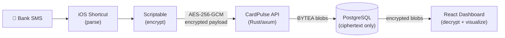
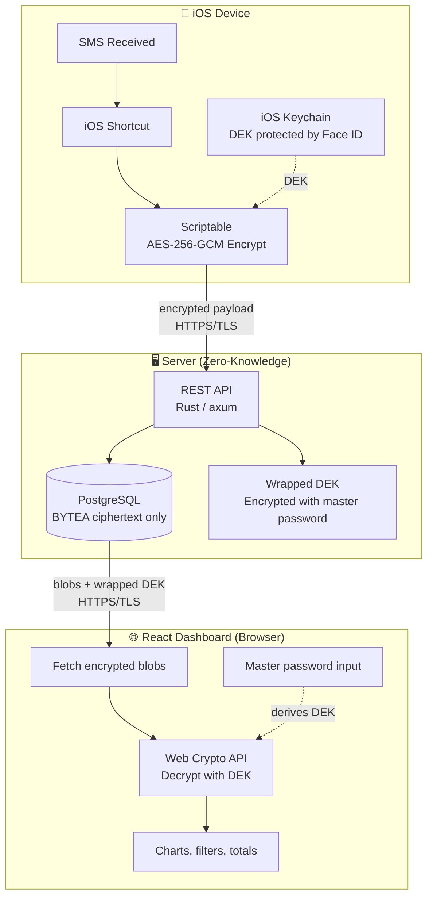
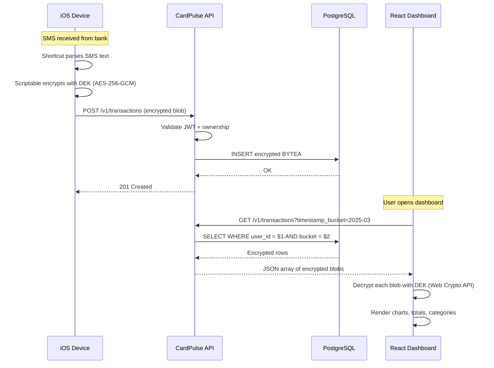
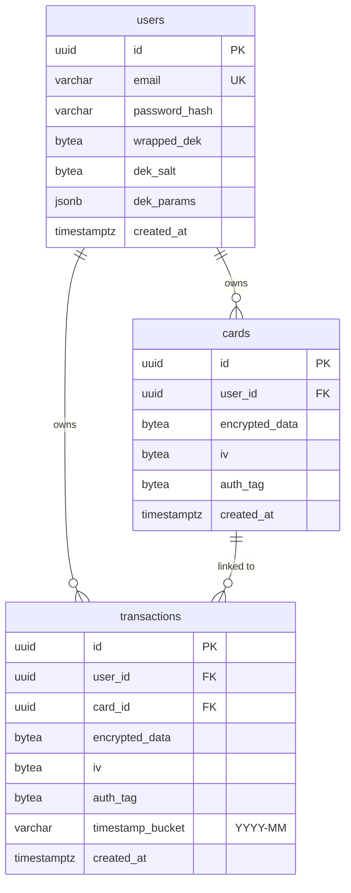
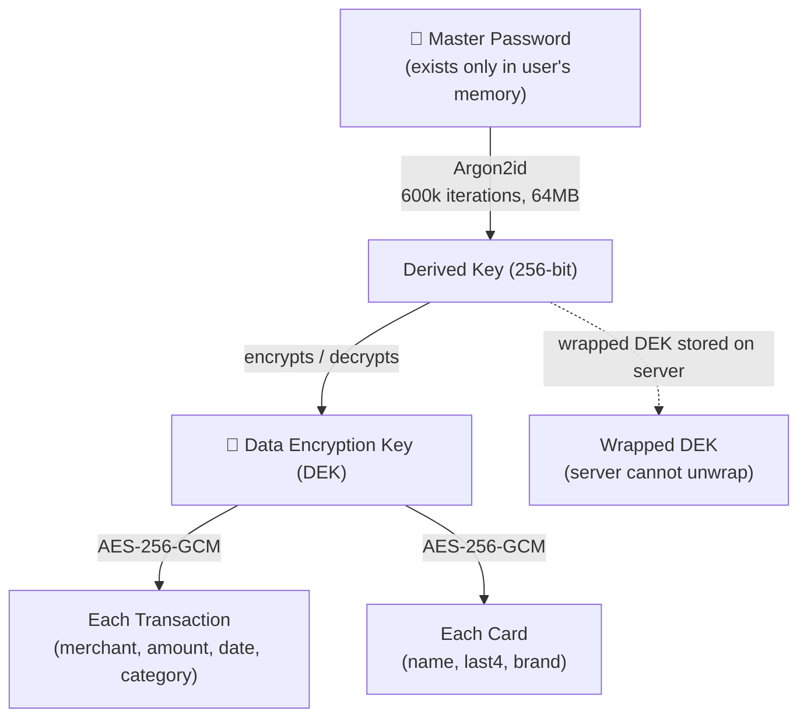

# CardPulse

> Real-time credit card expense tracker with end-to-end encryption. Your server never sees your data.

CardPulse automatically captures credit card purchases from SMS notifications on iOS, encrypts them on-device, and sends only ciphertext to the server. A React dashboard decrypts and visualizes your spending — all client-side. The server is a zero-knowledge encrypted blob store.

---

## Table of Contents

- [How It Works](#how-it-works)
- [Architecture](#architecture)
- [Database Schema](#database-schema)
- [Tech Stack](#tech-stack)
- [Getting Started](#getting-started)
  - [Prerequisites](#prerequisites)
  - [Setup](#setup)
  - [Running](#running)
- [API Reference](#api-reference)
  - [Authentication](#authentication)
  - [Cards](#cards)
  - [Transactions](#transactions)
  - [Key Management](#key-management)
- [Encryption Model](#encryption-model)
- [iOS Automation](#ios-automation)
- [Testing](#testing)
- [Deployment](#deployment)
- [Project Structure](#project-structure)
- [Contributing](#contributing)
- [License](#license)

---

## How It Works



1. Your bank sends an SMS like: `"Compra aprovada no seu PERSON BLACK PONTOS final *** - MERCADO EXTRA valor R$ 35,94 em 15/03, as 13h19."`
2. An iOS Shortcut captures the SMS and passes it to Scriptable
3. Scriptable parses the merchant, amount, date — then encrypts everything with your DEK (Data Encryption Key) via AES-256-GCM
4. The encrypted payload is sent to the CardPulse API over HTTPS
5. The server stores the opaque ciphertext — it cannot read your data
6. The React dashboard fetches encrypted blobs, decrypts them in-browser using the Web Crypto API, and renders charts and spending insights

---

## Architecture



### Request Lifecycle



---

## Database Schema



> **Note:** `encrypted_data`, `iv`, and `auth_tag` are opaque binary blobs. The server never decrypts them. Only `user_id`, `card_id`, `timestamp_bucket`, and `created_at` are queryable.

---

## Tech Stack

| Layer        | Technology                          | Purpose                              |
|--------------|-------------------------------------|--------------------------------------|
| **Backend**  | Rust, axum, tokio, sqlx             | REST API, async I/O, DB queries      |
| **Database** | PostgreSQL 16                       | Encrypted blob storage               |
| **Frontend** | React, TypeScript, Vite, Tailwind   | Dashboard with client-side decryption|
| **Crypto**   | aes-gcm, argon2, Web Crypto API     | E2E encryption, key derivation       |
| **Auth**     | JWT (jsonwebtoken crate)            | Stateless authentication             |
| **iOS**      | Shortcuts + Scriptable              | SMS capture, on-device encryption    |
| **Deploy**   | Fly.io (gru region), Docker         | Hosting, containerization            |
| **CI**       | GitHub Actions                      | Automated testing and linting        |

---

## Getting Started

### Prerequisites

- [Docker](https://docs.docker.com/get-docker/) and Docker Compose v2+
- [Rust 1.82+](https://rustup.rs/) (optional — only needed if running outside Docker)
- [Fly CLI](https://fly.io/docs/flyctl/install/) (only for deployment)
- `make` (pre-installed on macOS and most Linux distros)

### Setup

```bash
# Clone the repository
git clone https://github.com/your-username/cardpulse.git
cd cardpulse

# Copy environment variables
cp .env.example .env

# Start all services
make up

# Run database migrations
make migrate
```

That's it. The API is running at `http://localhost:8080` with hot reload enabled.

### Running

```bash
# Start services (db + db-test + api with hot reload)
make up

# Start with pgAdmin for database inspection
make up-tools

# Stop everything
make down
```

### Service Map

| Service     | Container           | Port  | Description                          |
|-------------|---------------------|-------|--------------------------------------|
| API         | `cardpulse-api`     | 8080  | REST API with hot reload             |
| PostgreSQL  | `cardpulse-db`      | 5432  | Development database                 |
| PostgreSQL  | `cardpulse-db-test` | 5433  | Isolated test database               |
| pgAdmin     | `cardpulse-pgadmin` | 5050  | DB GUI (optional, `--profile tools`) |

### Quick Commands

```bash
make help              # Show all available commands
make test              # Run all tests
make lint              # Run clippy (warnings = errors)
make fmt               # Format code
make ci                # Full CI pipeline (format + lint + test)
make logs              # Tail API logs
make db-shell          # Open psql to dev database
```

---

## API Reference

Base URL: `http://localhost:8080` (dev) | `https://cardpulse-api.fly.dev` (prod)

All data endpoints require a `Bearer` token in the `Authorization` header. Encrypted payloads are opaque to the server — it stores and returns them without validation or decryption.

### Authentication

#### Register

```
POST /auth/register
```

```json
{
  "email": "user@example.com",
  "password": "your-server-password",
  "wrapped_dek": "<base64-encoded-wrapped-DEK>",
  "dek_salt": "<base64-encoded-salt>",
  "dek_params": { "iterations": 600000, "memory": 65536, "parallelism": 4 }
}
```

| Status | Description                          |
|--------|--------------------------------------|
| 201    | Account created                      |
| 409    | Email already registered             |
| 422    | Invalid payload                      |

#### Login

```
POST /auth/login
```

```json
{
  "email": "user@example.com",
  "password": "your-server-password"
}
```

Returns:

```json
{
  "data": {
    "token": "<JWT>",
    "wrapped_dek": "<base64>",
    "dek_salt": "<base64>",
    "dek_params": { "iterations": 600000, "memory": 65536, "parallelism": 4 }
  }
}
```

| Status | Description                          |
|--------|--------------------------------------|
| 200    | Login successful                     |
| 401    | Invalid credentials                  |

#### Refresh Token

```
POST /auth/refresh
Authorization: Bearer <token>
```

| Status | Description                          |
|--------|--------------------------------------|
| 200    | New token issued                     |
| 401    | Invalid or expired token             |

### Cards

All card data (name, last digits, brand) is encrypted client-side. The server stores only the ciphertext.

#### List Cards

```
GET /v1/cards
Authorization: Bearer <token>
```

#### Create Card

```
POST /v1/cards
Authorization: Bearer <token>
```

```json
{
  "encrypted_data": "<base64-ciphertext>",
  "iv": "<base64-iv>",
  "auth_tag": "<base64-tag>"
}
```

| Status | Description                          |
|--------|--------------------------------------|
| 201    | Card created                         |
| 401    | Not authenticated                    |
| 422    | Invalid payload                      |

#### Update Card

```
PUT /v1/cards/:id
Authorization: Bearer <token>
```

#### Delete Card

```
DELETE /v1/cards/:id
Authorization: Bearer <token>
```

| Status | Description                          |
|--------|--------------------------------------|
| 204    | Card deleted                         |
| 401    | Not authenticated                    |
| 403    | Card belongs to another user         |
| 404    | Card not found                       |

### Transactions

Transaction data (merchant, amount, date, category) is encrypted client-side. The only plaintext metadata is `card_id` and `timestamp_bucket` (for server-side filtering).

#### List Transactions

```
GET /v1/transactions
GET /v1/transactions?card_id=<uuid>
GET /v1/transactions?timestamp_bucket=2025-03
Authorization: Bearer <token>
```

#### Create Transaction

```
POST /v1/transactions
Authorization: Bearer <token>
```

```json
{
  "card_id": "<uuid>",
  "encrypted_data": "<base64-ciphertext>",
  "iv": "<base64-iv>",
  "auth_tag": "<base64-tag>",
  "timestamp_bucket": "2025-03"
}
```

| Status | Description                          |
|--------|--------------------------------------|
| 201    | Transaction created                  |
| 401    | Not authenticated                    |
| 422    | Invalid payload or card_id           |

#### Update Transaction

```
PUT /v1/transactions/:id
Authorization: Bearer <token>
```

#### Delete Transaction

```
DELETE /v1/transactions/:id
Authorization: Bearer <token>
```

### Key Management

#### Rotate Key

Re-wraps the DEK with a new master password. The client decrypts the DEK with the old password and re-encrypts with the new one — the server only stores the updated wrapped DEK.

```
POST /v1/key/rotate
Authorization: Bearer <token>
```

```json
{
  "wrapped_dek": "<base64-new-wrapped-DEK>",
  "dek_salt": "<base64-new-salt>",
  "dek_params": { "iterations": 600000, "memory": 65536, "parallelism": 4 }
}
```

### Response Format

All successful responses follow:

```json
{
  "data": { ... }
}
```

All error responses follow:

```json
{
  "error": {
    "code": "VALIDATION_ERROR",
    "message": "timestamp_bucket must match YYYY-MM format"
  }
}
```

---

## Encryption Model

CardPulse uses a zero-knowledge architecture. The server stores only encrypted blobs and cannot read, search, or aggregate your financial data.

### Key Hierarchy



### What the Server Stores

| Data              | Stored As          | Server Can Read? |
|-------------------|--------------------|------------------|
| Merchant name     | AES-256-GCM blob   | No               |
| Transaction amount| AES-256-GCM blob   | No               |
| Transaction date  | AES-256-GCM blob   | No               |
| Card name/number  | AES-256-GCM blob   | No               |
| Category          | AES-256-GCM blob   | No               |
| Card ID (UUID)    | Plaintext reference | Yes              |
| Month bucket      | `"2025-03"`        | Yes              |
| Wrapped DEK       | Encrypted with KDF | No (without master password) |

### Trade-offs

Since the server cannot read data, all aggregation (totals, charts, category breakdowns) happens client-side after decryption. This is viable for personal use with hundreds of transactions per month. The `timestamp_bucket` field allows server-side filtering by month without decrypting everything.

---

## iOS Automation

### Requirements

- iPhone with iOS 16+
- [Scriptable](https://apps.apple.com/app/scriptable/id1405459188) app (free)
- iOS Shortcuts app (built-in)

### Setup

1. **Create the Scriptable script** — the script parses SMS text, encrypts with AES-256-GCM using the DEK stored in iOS Keychain, and POSTs to the API
2. **Create the iOS Shortcut** — triggers on SMS from your bank's sender, extracts the message body, and passes it to the Scriptable script
3. **Store the DEK** — on first setup, derive the DEK from your master password and store it in the iOS Keychain via Scriptable (protected by Face ID)

### Supported SMS Formats

Currently supported:

```
Compra aprovada no seu PERSON BLACK PONTOS final *** -
MERCADO EXTRA-1005 valor R$ 35,94 em 15/03, as 13h19.
```

Additional bank formats can be added by implementing new parser patterns. The system uses a parser chain with fallback — if the first pattern doesn't match, it tries the next one.

---

## Testing

CardPulse follows strict TDD (Test-Driven Development). Every feature is implemented test-first.

```bash
# Run all tests
make test

# Run tests with output visible
make test-verbose

# Run tests in watch mode (re-runs on file changes)
make test-watch

# Run full CI pipeline
make ci
```

### Test Structure

- **Unit tests:** co-located in source files under `#[cfg(test)]`
- **Integration tests:** in `tests/` directory, one file per domain
- **Test database:** isolated PostgreSQL instance on port 5433
- **Isolation:** each test runs in a transaction that rolls back

### Naming Convention

```
test_<action>_<condition>_<expected_result>
```

Examples:
- `test_create_transaction_with_valid_payload_returns_201`
- `test_login_with_wrong_password_returns_401`
- `test_list_transactions_filters_by_bucket`

### Minimum Coverage per Endpoint

Every endpoint must have tests for: happy path (2xx), missing auth (401), invalid token (401), bad payload (422), not found (404), and ownership violation (403).

---

## Deployment

CardPulse deploys to [Fly.io](https://fly.io) in the `gru` region (São Paulo, Brazil).

```bash
# First-time setup
fly launch --name cardpulse-api --region gru

# Set secrets
fly secrets set JWT_SECRET="<random-64-chars>"
fly secrets set DATABASE_URL="<fly-postgres-url>"

# Deploy
make deploy

# View logs
make deploy-logs
```

### Production Specs

| Resource  | Spec                         |
|-----------|------------------------------|
| VM        | shared-cpu-1x, 256MB RAM     |
| Region    | gru (São Paulo)              |
| Image     | ~15MB (debian-slim + binary) |
| Auto-stop | Enabled (scales to zero)     |
| HTTPS     | Forced (TLS termination)     |

---

## Project Structure

```
cardpulse-api/
├── CLAUDE.md                     # AI assistant rules and project context
├── README.md                     # This file
├── Cargo.toml                    # Rust dependencies
├── Dockerfile                    # Multi-stage: dev → builder → production
├── docker-compose.yml            # Local dev environment
├── Makefile                      # Development workflow commands
├── fly.toml                      # Fly.io deployment config
├── .env.example                  # Environment variables template
├── .claude/                      # Claude Code configuration
│   ├── settings.json             # Shell permissions
│   ├── rules/                    # Path-scoped coding rules
│   │   ├── rust-rules.md         # Rust conventions (src/**/*.rs)
│   │   ├── testing-rules.md      # TDD workflow (tests/**/*.rs)
│   │   ├── migration-rules.md    # SQL standards (migrations/**/*.sql)
│   │   ├── docker-rules.md       # Container conventions
│   │   └── documentation-rules.md
│   └── skills/                   # Invocable workflows
│       ├── tdd/SKILL.md          # /tdd — Red → Green → Refactor
│       ├── api-endpoint/SKILL.md # /api-endpoint — Full endpoint creation
│       └── refactor/SKILL.md     # /refactor — Safe code improvement
├── migrations/                   # SQL migrations (sqlx)
│   └── 001_initial.sql
├── src/
│   ├── main.rs                   # Server startup and router
│   ├── config.rs                 # Environment configuration
│   ├── db.rs                     # Database pool and migrations
│   ├── error.rs                  # AppError with IntoResponse
│   ├── routes.rs                 # Route assembly
│   ├── auth/
│   │   ├── handler.rs            # Register, login, refresh
│   │   ├── jwt.rs                # Token create/validate
│   │   ├── middleware.rs         # Auth extractor
│   │   └── password.rs           # Argon2 hashing
│   ├── models/
│   │   ├── user.rs               # User types
│   │   ├── card.rs               # Card types
│   │   └── transaction.rs        # Transaction types
│   ├── repositories/
│   │   ├── traits.rs             # Repository traits (DI)
│   │   ├── user_repo.rs          # PostgreSQL user repository
│   │   ├── card_repo.rs          # PostgreSQL card repository
│   │   └── transaction_repo.rs   # PostgreSQL transaction repository
│   └── handlers/
│       ├── cards.rs              # Card CRUD handlers
│       └── transactions.rs       # Transaction CRUD handlers
└── tests/
    ├── common/mod.rs             # Test helpers and fixtures
    ├── auth_test.rs              # Auth endpoint tests
    ├── cards_test.rs             # Card endpoint tests
    └── transactions_test.rs      # Transaction endpoint tests
```

---

## Environment Variables

| Variable               | Required | Default                    | Description                              |
|------------------------|----------|----------------------------|------------------------------------------|
| `DATABASE_URL`         | Yes      | —                          | PostgreSQL connection string (dev)        |
| `DATABASE_URL_TEST`    | No       | —                          | PostgreSQL connection string (test DB)    |
| `JWT_SECRET`           | Yes      | —                          | Secret for signing JWT tokens (64+ chars) |
| `JWT_EXPIRATION_HOURS` | No       | `24`                       | Token expiration time in hours            |
| `HOST`                 | No       | `0.0.0.0`                  | Server bind address                       |
| `PORT`                 | No       | `8080`                     | Server port                               |
| `RUST_LOG`             | No       | `info,cardpulse_api=debug` | Log level configuration                   |

---

## Contributing

1. Fork the repository
2. Create a feature branch: `git checkout -b feat/my-feature`
3. Follow TDD: write tests first, then implement
4. Run `make ci` to validate everything
5. Commit using conventional commits: `feat(scope): description`
6. Open a pull request

---

## License

MIT
